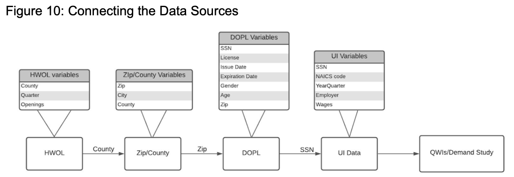
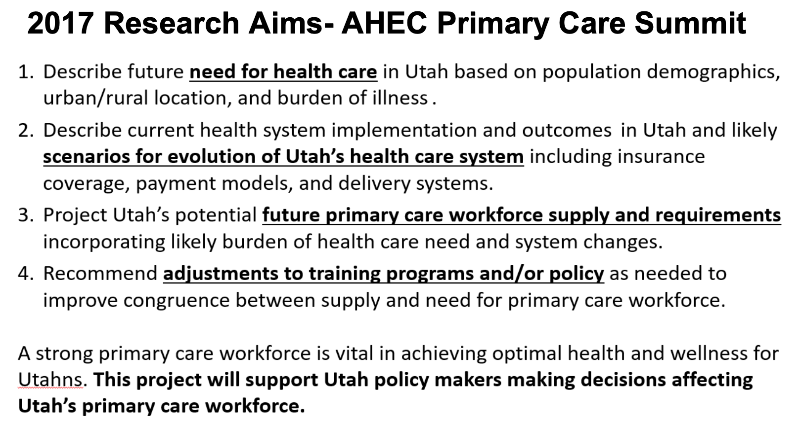
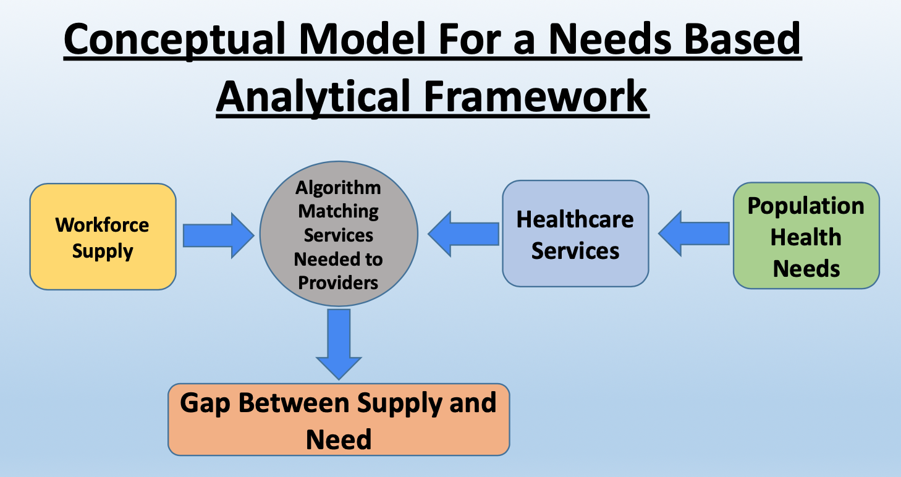
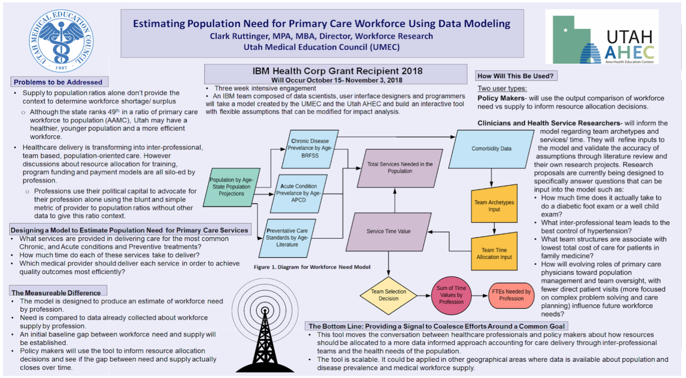
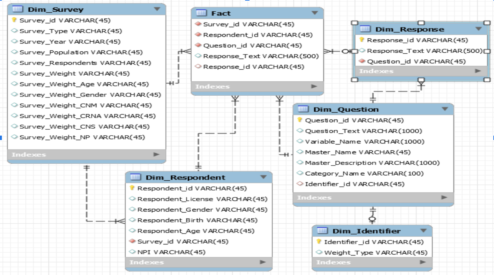

## Cases {.tabset}

### 80 % BSN by 2020

In 2008, The Robert Wood Johnson Foundation (RWJF) and the Institute of
Medicine (IOM) launched a two-year initiative to assess and transform
the nursing profession. In 2010, the IOM released [The Future of
Nursing: Leading Change, Advancing
Health](https://www.nursingworld.org/practice-policy/iom-future-of-nursing-report/){target="_blank"}
with the purpose of producing a report that would make recommendations
for an action-oriented blueprint for the future of nursing.

One of the messages from the report was the all too prescient call to
improve data. 

Specifically, they wanted to measure percent of Bachelors prepared
nurses across the country.

In 2015, I conducted the state's first RN workforce supply survey.
Analysis of this data found that 42% of the RN workforce was prepared at
a bachelors level [(pg
13).](https://umec-nursing.utah.gov/wp-content/uploads/UtahRN-LPNSupply2020-Final.pdf){target="_blank"}

In 2017, [Joanne Spetz,
PhD](https://nepincollaborative.org/wp-content/uploads/2018/07/Spetz-2018-BSN-80-percent-forecast.pdf){target="_blank"}
of the [Philip R. Lee Institute for Health Policy Studies, University of
California, San
Francisco](https://healthpolicy.ucsf.edu/philip-r-lee-institute-health-policy-studies){target="_blank"}
analyzed how far that goal was from being actualized nationally by
creating a projection model of bachelors prepared nurses in the national
nursing workforce using the [American Community
Survey](https://www.census.gov/programs-surveys/acs)(ACS){target="_blank"}.

Inspired by Dr. Spetz' work, my team and I created an [interactive
projection](https://umec-nursing.utah.gov/bsn-projections/){target="_blank"}
of the Utah nursing workforce using Utah sources for the projection
rather than the ACS. The projection model allows a user to modify the
inputs to the model to examine how altering these input variables
affects the projected bachelors prepared workforce percentage. The
baseline projection showed Utah going from 55% bachelors prepared in
2017 to 61% by 2020. Even projecting out as far as 2035, Utah only stood
to be at a 72% bachelors prepared workforce, assuming that none of the
factors in the projection model changed. When my team and I surveyed the
Utah RN workforce in 2020, we found that the bachelors prepared
workforce had risen to 56.2% [(pg
29).](https://umec-nursing.utah.gov/wp-content/uploads/UtahRN-LPNSupply2020-Final.pdf){target="_blank"}

The value of this model is two fold:

**1.  Demonstration of underlying factors involved in measuring the
    state's system for producing nurses. The model uses data from
    several sources to produce the projection.**

-   UMEC RN supply surveys

    -   Retention, Attrition and Retirement rates

-   UMEC's RN Education survey of all nursing schools in Utah

    -   Number of graduates per year by age and program type

-   Nurse Licensing data from the State of Utah

    -   Current workforce by age

-   Utah Population Projections from census and state demographers

-   National Council of State Boards of Nursing national estimates of
    RNs

**2.  Ability to produce counterfactuals to examine best the best strategy
    of attaining a defined goal for the system.**

-   What is the result in the model of adjusting for the impacts on
    enrollment from the pandemic ?

-   What will happen as the model is adjusted for anticipated future
    retirements?

-   Do targeted increases in the number of available seats in programs
    result in more retained graduates of specific types?

Ultimately further work needs to be done to take this from a single use
specific model to an operationalized and automated application for projecting
the future state of any point in the system. My team and I intend to pursue this work in 2023. 

### Nursing Employment Demand

Out of the [The Future of Nursing 2010-
2020](https://www.nursingworld.org/practice-policy/iom-future-of-nursing-report/){target="_blank"}
report the The Robert Wood Johnson Foundation and AARP created the
Campaign for Action. Through this campaign an [action coalition was
created in each state](https://campaignforaction.org/state/utah/) to
implement the goals of the Future of Nursing Report.

In 2018, the Utah nurse action coalition worked with Utah Legislators to
produce [S.B.
147](https://le.utah.gov/~2018/bills/static/SB0147.html){target="_blank"}.
This nursing initiative required the UMEC to produce a nursing demand
study for the state and for funding of nurse education programs to be
tied to identified future nursing employment needs.

I developed the methodology and data linkages to produce a [nursing
employment demand
study](https://umec-nursing.utah.gov/wp-content/uploads/UtahRNEmploymentDemand2020.pdf){target="_blank"}
from existing state data sources that can be updated at future periods
automatically by refreshing the source data.

<!--  -->

This design allows for a persistent dashboard application to be created
to update the employer demand analysis when needed. 

My team and I
produced our baseline report in 2020. It captured the first quarter of
the pandemic. We are currently working on a release of an update to the
analysis that will look back on what happened over the pandemic time
period (Q2 2020 through Q3 2021).

I developed the methodology for this employer demand study from sources
identified through my own literature review. The two primary guiding
sources are quite disparate in nature but compliment and inform each
other very well.

The first is the National Forum of State Nursing Workforce Centers
[minimum data set recommendations for
demand](https://nursingworkforcecenters.org/wp-content/uploads/2021/12/Nurse_Demand_MDS_RevisedDecember2020.pdf){target="_blank"}.
These are a set of recommended questions to be asked of nursing
employers in each state to measure nursing employer demand. Typically
these questions are deployed through a survey methodology to identified
nursing employers in a state. I produced demand studies for the state of
Utah using a [survey methodology in 2015 and
2018.](https://umec-nursing.utah.gov/nursing-demand/){target="_blank"}
The shortcomings of this previous methodology, namely that it is very time
intensive to gather data in this manner, made me want to look for a
better way to produce a demand study into the future.

The second source for the methodology I developed are the [Quarterly
Workforce Indicators
(QWI)](https://lehd.ces.census.gov/doc/QWI_101.pdf){target="_blank"}
published by the U.S. Census. QWIs provide local labor market statistics
by industry, worker demographics, employer, age and size. The source
data are unique job-level data that link workers to their employers.

<!--   -->

The nursing employment demand report goes into detail on the strengths
and weaknesses of this methodology. My personal thoughts as a data
analyst and designer are that the methodology utilizes defined questions
and equations from national sources to produce a standardized analysis
that can be replicated in any state where someone can connect state
licensing records and supplemental workforce supply surveys to state
Unemployment Insurance records. The analysis is not dependent on
arbitrary survey participation rates from health system administrators. It
takes advantage of transactional data already being produced by state
government to add valuable system insights.

### Operationalizing Supply Surveys

In 2010 I was hired by the [Utah Medical Education
Council](https://umec.utah.gov){target="_blank"} to design, print, fold
and mail out thousands of paper surveys a year by hand. Back then I also
built my own data entry data bases and manually entered all of my survey
responses. I would then clean and process the data using SPSS and Excel.
Finally, I would type up my analysis and paste in all of the tables,
charts and graphs into a PDF and send that to be printed and spiral
bound. I've taught others this process while simultaneously making small
improvements every year since. The problem with this process is that we are using
20th century tools to do work that could be much improved using modern
analytics tools. As I looked at our past survey work, I found that our response
rates were beginning to tank. We went from high 60% range responses in
the first decade of surveying the health workforce with mailed paper
surveys to the high 20% range by 2020. While this is still a
statistically valid sample representing the state of Utah, over time we
are losing granularity to describe and model health professions at
geographic levels below the entire state such as zip codes or census
tracts and further analysis by sub specialty or work setting becomes
more difficult. No professionals are surveyed as much as health care
professionals. They are over saturated and tired of responding to
surveys.

**UMEC Health Profession Supply Survey Response Rates 1997 to 2020**

In 2020 I transitioned our data collection process to be fully online.
Now I send out invitations to take our surveys to the email addresses on
file with the state professional licensing records.

The survey pictured is one of the last paper surveys to ever be returned
to the UMEC. This happens every so often. I get a response two years
after I sent out the survey (also a year after I published the results
of the survey). It always makes me laugh a little and wonder why the
person decided to finally send in the response.

Modernization of our data collection process has allowed us to focus
more time on advanced analytics and informatics. Last year my team
and I modernized our analysis platform with a data warehouse built in an
AWS cloud environment We produced our most recent health profession
workforce survey on [Utah's Mental Health
Workforce](https://umec.utah.gov/publications/mental-health/){target="_blank"}
using Python and R and piped the analysis to dashboards and report
templates in Tableau and R Shiny. This work serves as a code base for us
to refine with new health professions analysis as we produce them. We
are currently working on an update to our APRN workforce study that will
iterate and improve on the templates built for our Mental Health
workforce analysis

We have also began to explore application of machine learning to the
data we have available to us. From the work my team and I did to clean
and standardize our historic data, one of my analysts decided to use our
datasets for his capstone project to complete his Masters of Statistics.
We ended up with a paper published in 2022 from his work, in the Journal of Rural and Remote Health. [Using ML to Predict Rural
Practice Decision in the Health
Workforce](https://www.rrh.org.au/journal/article/7050){target="_blank"
rel="noopener noreferrer"} We are excited to continue to build off of
this work as we further automate our data collection, cleaning,
transformation and storage processes.

### IBM Utah Teamcare Model

In 2017, the [Utah Area Health Education
Centers](https://utahahec.org){target="_blank"
rel="noopener noreferrer"} at the time, under the direction of [Michael
K. Magill,MD](https://www.theabfm.org/about/board/michael-k-magill-md),
convened its first annual Primary Care Summit.

My office contributed funding to Dr. Magill to begin to pursue his stated
research aims. I began meeting with Dr. Magill to understand how I could
support his work with data and analysis. As we met together and
brainstormed ideas we decided that we wanted to come up with a way to
calculate population health need in comparison to workforce supply and
compare the number of FTEs required to provide all primary care needs
for the Utah population to the number of FTEs in the primary care
workforce in the state.

 I began to explore data sources to represent
population health needs and started working on a prototype calculation
model using Microsoft Excel. Through Dr. Magill's national contacts we
were made aware of the [IBM Healthcorps](http://ibmhealthcorps.org). We were told that they were
looking for a health workforce project to get involved with. I wrote up
our proposal and [we were awarded an in-kind work
grant](https://www.ibm.org/initiatives/ibm-service-corps/csc-7){target="_blank"
rel="noopener noreferrer"} for a team of IBM designers, architects and
data scientists to come and work on our project. I produce a poster
about our concept and was accepted at the Academy Health, National
Health Policy Orientation in the summer of 2018 to present the work.

The IBM team spent three weeks with our research team. We met with their
data scientist first to explain the Excel model and concept. IBM had us
organize health stakeholders across the state to engage in design
sessions with their user interface designers. The IBM team asked
stakeholders three questions.

1.  How do you currently design education programs/ make program
    decisions today?

2.  What is the current process for allocating or designing care teams
    within a practice today?

3.  How do you make decisions on healthcare allocations today?

The design team explained to me that their goal was to take a survey of
the entire ocean that is health workforce policy making in Utah. Then
they would decide with our help, where in that ocean to dip their teacup and then they
would boil that cup of ocean down to its essence. As I worked with the
team over three weeks I had the extraordinary privilege to watch the
process of [IBM Design](https://www.ibm.com/design/) thinking unfold. At the end of the engagement, we
had a functioning minimum viable modeling product built in [Python](https://www.python.org), [React](https://reactjs.org), [Node JS](https://nodejs.org/en/) and
[Docker](https://www.docker.com), along with documentation of how the application works and a plan for how to
move forward with building on the initial IBM work.

The model produces three specific outputs.

1.  Ideal provider staffing

    -   Given population need, what would be an optimal provider team
        composition (ie: types and number of providers)

2.  Ideal provider staffing constrained by current providers composition

    -   Given population need and current provider composition, what
        would be an optimal provider team composition?

3.  Ideal service/ task allocation

    -   Given providers current composition, what would be an optimal
        task/service allocation?

Since the engagement I have continued to meet with Dr. Magill on a
weekly basis. We have convinced others to join us. We have been able to
advance the project through some growth over the last few years. We
secured funding from the Utah State Legislature in 2019 to build out
designs created by IBM of a front end, web-based user interface for the
model. The model and interface are running on a state of Utah domain and
can be examined at <https://teamcare.utah.gov> The model is currently loaded with prototype data. Users can create their own load of the model by providing data they deem sufficient to the input requirements and can save their own profile and modeling outputs. 

Work on the Utah Team Workforce Model continues today. 

Current work is focused on three aims:

1.  Load the model with available data sources
2.  Validate model inputs with real world observational studies
3.  Assess usability of the tool with users

We are currently developing and submitting research proposals related to each of these aims. the team is also conducting literature review on the application of machine learning to claims databases to explore how we want to approach loading the source data on patient populations into the model as patient archetypes based on primary care utilization patterns. 

Over the last year, I built a [graph database](https://medium.com/@timo.klimmer/what-the-heck-is-a-graph-database-cd92ae041b5a){target="_blank"} of three years of data from the [Utah All Payers Claims Database](https://stats.health.utah.gov/about-the-data/apcd/){target="_blank"} to explore how to create patient archetypes within the Utah population,  clustered by utilization patterns to represent patients in the model. 

### National Forum Data Interconnection

[The National Forum of State Nursing Workforce Centers](https://nursingworkforcecenters.org/about-us/){target="_blank"} is a not-for-profit membership organization with member centers in 38 states. a Member entity in each state is designated as the state workforce center. Since 2015, I have participated with the National Forum as Utah's Center Director. The centers engage in advocacy for the nursing profession and share best practices in advancing national nursing goals. The National Forum produces and maintains the [National Minimum Nursing Data Set (MDS) recomendations](https://nursingworkforcecenters.org/dataset/){target="_blank"} for gathering supply, demand and education data about nurses in each state. 

As I became involved with the National Forum, I became acquainted with nursing center directors across the country. Many of these centers are dedicated to running nursing education programs and advocating for policy change at the state level. The large majority of these center directors were nurses of a certain age. These nurses have vast experience in the profession. They are masters of taking information and initiating change in their states. They are a deep network of nursing expertise in the country on every subject related to nursing workforce policy and planning. 

In 2018, I joined the board of the National Forum and served as Board President from 2019 to 2020. During that time I was able to [engage in a project and discussions with colleagues in various states](https://docs.google.com/presentation/d/1epsYn5cg7j-h5PYT9gUrKC7LImMZhxgqi54-t_8B-bw/edit#slide=id.g8061198324_0_69){target="_blank"} about how to collect, analyze and share information about the nursing workforce across the country.

I proposed that states with National Forum presence each submit a set of aggregates based on the National Forum's supply MDS from the data collected about the nursing workforce supply in their state to a template that I worked to develop with others on the National Forum's research committee. I had a member of my work team throw together a [national map in Tableau](https://public.tableau.com/app/profile/andrew.salt/viz/ForumRN/LandingPage){target="_blank"} to show the submission data from each state. 

The purpose of this project was to create a national picture of the nursing workforce in each state from the entities producing state level nursing workforce data and analysis. This, I argued, would produce a better picture of the national nursing workforce than top down, national nursing surveys produce. The information would be coming from the bottom up and could be updated at regular intervals coinciding with when states updated their state level nursing supply surveys.

I worked with Forum members to understand how the template for data submission would work best. I presented at Forum meetings and conferences on the idea. Ultimately, out of 38 member states, I was only able to get 10 of them to submit their aggregated data to our Tableau dashboard. These 10 states are the states with the most alignment around data collection and analysis managed or controlled in some way by the state nursing workforce center. States who did not submit had different reasons for not submitting. They were not the ones producing the data or they did not have the skills, knowledge or budget to have the data aggregated in the way we set up. Ultimately, the low participation in this project showed the Forum that they have work to do in terms of improving engagement with member states and building connections within states to the people who know how to analyse health workforce data. I continue to interact with the National Forum on a volunteer basis and seek to find ways to produce new projects analyzing workforce migration and interstate compact participation across the country. 

### Utah Health Workforce Coalition

In early 2018, I was invited by the National Governors Association to
participate in a policy engagement they were holding around health
workforce. They flew me and three other representatives from Utah they
had identified as key health policy influencers to their offices in DC to talk with them
about what states were doing to improve access and quality to data to
inform better health policy. We were introduced to [Dr. Hannah Maxey
from the Bowen Center for Health Workforce
Policy](https://bowenportal.org/index.php/about-us/our-team/){target="_blank"}
at the University of Indiana Medical School. She presented to us the
work she has done in advancing health workforce policy in her state and
provided us with a template for thinking about how to approach
identifying all players within the system in our state and how we would
go about approaching change.

Later, in October of 2018, I was invited along with a colleague from the
[Utah Office of Primary Care and Rural Health](https://ruralhealth.health.utah.gov) (OPCRH) to submit a
proposal for how we would go about making change to improve the use of
data to impact health workforce policy in Utah.

The OPCRH is the office that calculates the [Health Professional
Shortage Area
designations](https://bhw.hrsa.gov/workforce-shortage-areas/shortage-designation){target="_blank"}
for HRSA in Utah. This calculation is done through an antiquated process
of gathering survey data and hiring an army of phone surveyors to call
clinics across the state and validate the survey responses. It is a
process that is done independent of any other data collection processes
in the state. It needed to be improved with a new methodology that uses
21st century tools.

Our proposal was to integrate the supplemental workforce supply surveys
that my office has done since 1997 with the license renewal process for
health professional licenses in the state and to collect the information
required for calculating HPSAs from this survey. We proposed to create
use cases around the Nursing Workforce and the Mental Health workforce
in order to involve key stakeholders in those professions and to align
with focusing issues that were [already emerging in
Utah](https://gardner.utah.edu/wp-content/uploads/MentalHealthReportAug2019.pdf){target="_blank"}
about concerns over shortages of nursing and mental health providers to
meet demands of a growing population with increasing healthcare needs.

The OPCRH had access to funding from HRSA to hire a coordinator to
engage with stakeholders in the state around this idea. We created the
Utah Health Workforce Coalition with the mission of having a diverse,
well-qualified and sustainable workforce that equitably meets the needs
of all Utah residents, with emphasis for those in rural and underserved
areas. We hired Dr Maxey to take us through the process of developing a
strategic plan for how we would make change. Out of the work of many
hours of discussions with this coalition of stakeholders we came up
with a plan that recommended legislation to integrate supplemental supply
surveys with the state licensing process and to create an advisory
council within state government to guide and approve survey questions and
analysis that would come from this data collection.

At this point in time I had a long history of talks with legislators and
various health professional stakeholders about how we could make change
in Utah. They all saw the need for change. We were lacking the political
will to make the change though. The onset of the pandemic became an
accelerator and a focusing event on showing the desperate need for
improvements to our system for informed decision making around health
policy.

After engagements with many states on the question of how to leverage data for better health workforce policy, the [NGA produced a brief](https://www.nga.org/center/publications/informing-health-care-workforce-policy-leveraging-data/){target="_blank"} to inform governors and states about how to go about this important work. 

With our strategic plan in hand and the obvious need demonstrated by the
pandemic, we approached Utah Representative Norman Thurston, to consider a bill. He was of course already well aware of our
work and well prepared to take this plan and run with it. [HB 176 The
Utah Health Workforce
Act.](https://le.utah.gov/~2022/bills/static/HB0176.html) was passed in
the 2022 Utah Legislative session with broad support and no substantive
opposition.

I'm hopeful for the improvements that will come with the passage of this
act! I look forward to what the changes will bring in terms of improved
collaboration in improving health policy in Utah. We are moving from a
situation where everyone is touching different parts of the elephant 

to
a a form more like a beehive where we are working together for common
goals. Quite appropriate for the Beehive State!

### Modeling a Health Workforce Data Warehouse

For all of the survey work I've done over the last 12 years, I have designed and built data entry databases in Microsoft access or survey scanning software like [SNAP](https://www.snapsurveys.com){target="_blank"} for OCR scanning and [Qualtrics](https://www.qualtrics.com){target="_blank"} for online surveys. I built data entry databases for companies we contracted ocasionally for larger projects like the [2015 Utah RN Workforce Supply Survey](https://umec-nursing.utah.gov/wp-content/uploads/RN-report-final-updated5-9-2016.pdf){target="_blank"}. 

As I finished my MBA electives with a certificate in Information Systems I became interested in how to consolidate and better connect annual surveys I had administered over years at the UMEC to other data sets I had access to for analysis.

As a [final project ](https://docs.google.com/presentation/d/1CGLkNZEPoMEMbPDFDQXgLmKfQRNHwxla/edit?usp=sharing&ouid=105000908584582998954&rtpof=true&sd=true){target="_blank"} for a class in data warehouse design, I designed a small data warehouse to store a survey collected from an annual survey of nursing deans across the state of Utah in collaboration with the [Utah Organization of Nurse Leaders, Academic Leadership Committe](https://utahnurseleaders.nursingnetwork.com){target="_blank"}.

I developed that work with my team at the UMEC into a Tableau dashboard about [Utah Nursing Workforce Education](https://umec-nursing.utah.gov/nursing-education/){target="_blank"}. This survey is updated annually as data is submitted from nursing programs.

in July of 2018 I hired a computer science undergrad as an intern and I assigned one of my research analysts to work with me to design a data warehouse of all of the health professional workforce supply surveys that had been produced by the UMEC since they started collecting them in 1997.

These surveys had been administered in different years to different health professions. With each survey administration there were small changes made to survey instruments to add questions or change wording. Because of regular staff turnover, there had never been much standardization to the survey process.

I started with a literature review to find database designs that solved a similar problem of using a [dimensional data warehouse to standardize historical survey data](https://nces.ed.gov/FCSM/pdf/II_B_Yost_FCSM1999.pdf){target="_blank"}.

The solution we built using MySQL contained 6 tables in total:

1.  The fact table stores all the responses for each respondent.

2.  Dim Survey stores survey information such as the surveys’ types, year, population, number of respondents and weight.
Dim Respondent stores respondent information such as their license numbers, NPI, gender, date of birth and age.

3.  Dim Question stores question texts and their corresponding master variables for standardization.

4.  Dim Response stores response texts for certain questions that provides fixed answers for respondents to choose.

5.  Dim Identifier stores different weight types.

I had my team validate the results of our work against our previously published analysis using the same data. They wrote up their work and [presented it to the UMEC.](https://docs.google.com/presentation/d/1-vAFNi2LHSIr9DB3ts499JpuhqPEOY-r3SFpbWIIWes/edit#slide=id.g5aab392ecc_0_673){target="_blank"}.

My team and I have since iterated this design and produced a 2.0 version of our DW in our Amazon cloud environment. Primary changes were to organize surveys into better categories so that it is easy to identify questions universal to all professions in all years (demographics and hours worked for example), questions specific to a profession(eg: residency location or work setting) and questions that are both profession and year specific (eg: how many babies do you as a CNM deliver each year). 

We are currently working on connecting this schema to Tableau dashboards to provide workforce and profession specific information and to feed future workforce reporting and analysis.

We are also working to interconnect additional government, public and private data sets into our data model. 

Long term intentions are to map to a standard such as the [OMOP Common Data Model](https://www.ohdsi.org/data-standardization/) so that we can produce more standardized analysis that can be replicated and compared across the country. 

### Modeling a Graph Database in NEO4J

Out of the application design engagement my research team was awarded with IBM, we began to develop an understanding of what we needed to do to create a data set representative of all primary care service needs in the Utah state population.

As I spoke at conferences and networked with people about our modeling ideas, I met a brilliant nurse informaticist working for the VA a the time named [Stephen Weaver](https://www.linkedin.com/in/stephen-weaver-rn) who suggested that I look into using a graph database as the solution.

As the pandemic hit and we were all isolated at home, Stephen and I decided to have weekly Zoom meetings to talk about ideas and collaborate on a project in a graph database platform called [NEO4J](https://neo4j.com/) together.

We decided that our approach would be to model a graph database of 3 years of the [Utah All Payers Claims Database](https://stats.health.utah.gov/about-the-data/apcd/)(APCD) so that we could easily run various clustering machine learning algorithms to look for utilization patterns in the data to identify patient archetypes in the population.  This approach had several benefits.

1.  The NEO4J Community Edition is free and open source. This allowed us to build our prototype with only the cost of the sweat equity we were willing to contribute.

2.   NEO4J Community Edition also comes as a server version that can be deployed in an AWS environment and accessed through a web browser with a user login. This allowed us to securely load and host our graph on a domain hosted by the State of Utah. We were able to allow specific members of our research team to access the graph and continue to work together while we were all living separately through a global pandemic.

We began with submitting a request to the [Utah Office of Healthcare Statistics](https://stats.health.utah.gov) that manages the state APCD to receive the data we wanted to analyze.  

We then made a plan for how to ETL the data into the files required to load the graph in NEO4J. 

We used [Talend Data Integration](https://www.talend.com/products/integrate-data/) to extract data from the large raw data files we received, transform it and clean it and load it into a [PostgreSQL](https://www.postgresql.org/) database. 

From there, we ran SQL quereies to produce the files to load according to the graph schema we designed for NEO4J

Here is the same schema in NEO4J after we loaded our initial test files. 

We are currently working on improving the data load process and cleaning up some identified bugs so that we can begin pursuing our exploration of machine learning algorithms to this data set. 