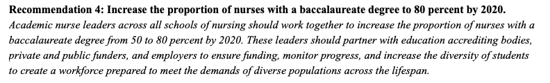

## Cases {.tabset}

### 80 % BSN by 2020

In 2008, The Robert Wood Johnson Foundation (RWJF) and the Institute of
Medicine (IOM) launched a two-year initiative to assess and transform
the nursing profession. In 2010, the IOM released [The Future of
Nursing: Leading Change, Advancing
Health](https://www.nursingworld.org/practice-policy/iom-future-of-nursing-report/)
with the purpose of producing a report that would make recommendations
for an action-oriented blueprint for the future of nursing.

One of the messages from the report was the all too precient call to
improve data.  

Specifically, they wanted to
measure percent of Bachelors prepared nurses across the country.

 In 2015, I conducted the state's first RN workforce
supply survey. Analysis of this data found that 42% of the RN workforce
was prepared at a bachelors level [(pg
13).](https://umec-nursing.utah.gov/wp-content/uploads/UtahRN-LPNSupply2020-Final.pdf)

In 2017, [Joanne Spetz,
PhD](https://nepincollaborative.org/wp-content/uploads/2018/07/Spetz-2018-BSN-80-percent-forecast.pdf)
of the [Philip R. Lee Institute for Health Policy Studies, University of
California, San
Francisco](https://healthpolicy.ucsf.edu/philip-r-lee-institute-health-policy-studies)
analyzed how far that goal was from being actualized nationally by
creating a projection model of bachelors prepared nurses in the national
nursing workforce using the [American Community
Survey](https://www.census.gov/programs-surveys/acs)(ACS).

Inspired by Dr. Spetz' work, my team and I created an [interactive
projection](https://umec-nursing.utah.gov/bsn-projections/) of the Utah
nursing workforce using Utah sources for the projection rather than the
ACS. The projection model allows a user to modify the inputs to the
model to examine how altering these input variables affects the
projected bachelors prepared workforce percentage. The baseline
projection showed Utah going from 55% bachelors prepared in 2017 to 61%
by 2020. Even projecting out as far as 2035, Utah only stood to be at a
72% bachelors prepared workforce, assuming that none of the factors in
the projection model changed. When my team and I surveyed the Utah RN
workforce in 2020, we found that the bachelors prepared workforce had
risen to 56.2% [(pg
29).](https://umec-nursing.utah.gov/wp-content/uploads/UtahRN-LPNSupply2020-Final.pdf)

The value of this model is two fold:

1.  Demonstration of underlying factors involved in measuring the
    state's system for producing nurses. The model uses data from
    several sources to produce the projection.

-   UMEC RN supply surveys

    -   Retention, Attrition and Retirement rates

-   UMEC's RN Education survey of all nursing schools in Utah

    -   Number of graduates per year by age and program type

-   Nurse Licensing data from the State of Utah

    -   Current workforce by age

-   Utah Population Projections from census and state demographers

-   National Council of State Boards of Nursing national estimates of
    RNs

2.  Ability to produce counterfactuals to examine best the best strategy
    of attaining a defined goal for the system.

-   What is the result in the model of adjusting for the impacts on
    enrollment from the pandemic ?

-   What will happen as the model is adjusted for anticipated future
    retirements?

-   Do targeted increases in the number of available seats in programs
    result in more retained graduates of specific types?

Ultimately further work needs to be done to take this from a single use
specific model to an operationalized and automated model for projecting
the future state of any point in the system.

### Nursing Employment Demand

Out of the [The Future of
Nursing 2010- 2020](https://www.nursingworld.org/practice-policy/iom-future-of-nursing-report/) report the The Robert Wood Johnson Foundation and AARP created the Campaign for Action. Through this campaign an [action coalition was created in each state](https://campaignforaction.org/state/utah/) to implement the goals of the Future of Nursing Report.   

In 2018, the Utah nurse action coalition worked with Utah Legislators to produce [S.B. 147](https://le.utah.gov/~2018/bills/static/SB0147.html). This nursing initiative required the UMEC to produce a nursing demand study for the state and for funding of nurse education programs to be tied to identified future nursing employment needs. 

I developed the methodology and data linkages to produce a [nursing employment demand study](https://umec-nursing.utah.gov/wp-content/uploads/UtahRNEmploymentDemand2020.pdf) from existing state data sources that can be updated at future periods automatically by refreshing the source data. 

This design allows for a persistent dashboard application to be created to update the employer demand analysis when needed. My team and I produced our baseline report in 2020. It captured the first quarter of the pandemic. We are currently working on a release of an update to the analysis that will look back on what happened over the pandemic time period (Q2 2020 through Q3 2021).

I developed the methodology for this employer demand study from sources identified through my own literature review. The two primary guiding sources are quite  disparate in nature but compliment and inform each other very well. 

The first is the National Forum of State Nursing Workforce Centers [minimum data set recommendations for demand](https://nursingworkforcecenters.org/wp-content/uploads/2021/12/Nurse_Demand_MDS_RevisedDecember2020.pdf). These are a set of recommended questions to be asked of nursing employers in each state to measure nursing employer demand. Typically these questions are deployed through a survey methodology to identified nursing employers in a state. I produced demand studies for the state of Utah using a [survey methodology in 2015 and 2018.](https://umec-nursing.utah.gov/nursing-demand/) The shortcomings of this methodology, namely that it is very time intensive to gather data in this manner, made me want to look for a better way to produce a demand study into the future. 

The second source for the methodology I developed are the [Quarterly Workforce Indicators (QWI)](https://lehd.ces.census.gov/doc/QWI_101.pdf) published by the U.S. Census. QWIs provide local labor market statistics by industry, worker demographics, employer, age and size. The source data are unique job-level data that link workers to their employers. 

The nursing employment demand report goes into detail on the strengths and weaknesses of this methodology. My personal thoughts as a data analyst and designer are that the methodology utilizes defined questions and equations from national sources to produce a standardized analysis that can be replicated in any state where someone can connect state licensing records and supplemental workforce supply surveys to state Unemployment Insurance records. The analysis is not dependent on arbitrary participation rates from health system administrators. It takes advantage of transactional data already being produced by state government to add valuable system insights.   

### Operationalizing Supply Surveys

You can also embed plots, for example:

Note that the `echo = FALSE` parameter was added to the code chunk to
prevent printing of the R code that generated the plot.

### IBM Utah Teamcare Model

This one

### National Forum Data Interconnection

This one as well

### Utah Health Workforce Coalition

and this
